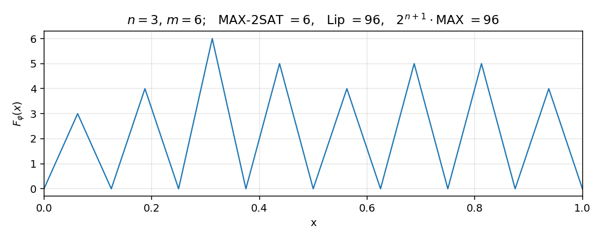
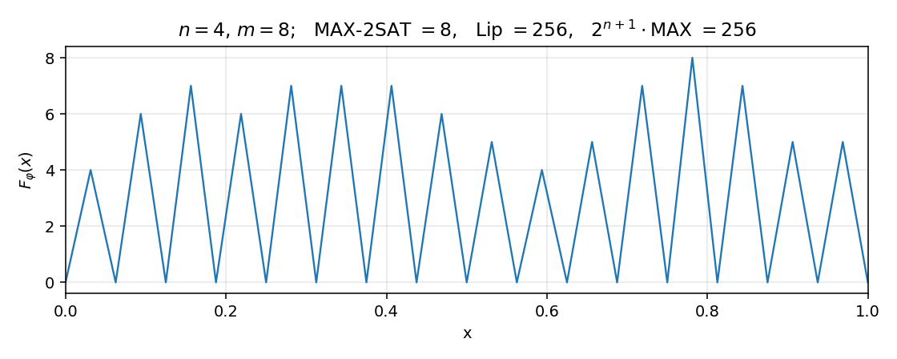
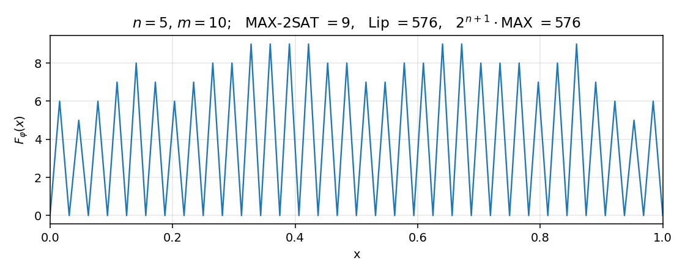

# MAX2-SAT-to-NN

Construct, for any MAX-2SAT formula $\varphi$ with $n$ variables and $m$
clauses, a polynomial-size scalar ReLU network $F_\varphi : [0, 1] \to \mathbb{R}$
whose Lipschitz constant satisfies

$$
\mathrm{Lip}(F_\varphi) \;=\; 2^{\,n+1}\,\cdot\,\mathrm{MAX\text{-}2SAT}(\varphi).
$$

The construction:

1. **Tent**  $g(x) = \mathrm{ReLU}(2x) - 2\,\mathrm{ReLU}(2x - 1)$ — depth 1, width 2.
2. **Sawtooth**  $T_n = g \circ g \circ \cdots \circ g$ ($n$ times) — depth $n$, width 2;
   it has $2^n$ linear pieces of slope $\pm 2^n$ on $[0, 1]$.
3. **Bit signal**  $b_k(x) = T_k(\mathrm{ReLU}(2 T_{n-k}(x) - 1))$ — depth $n+1$, width 2;
   triangular spikes (height 1, width $2^{-n}$) marking the intervals where bit $k$ is set.
4. **OR**  $\max(a, b) = \tfrac{1}{2}(a + b + \mathrm{ReLU}(a - b) + \mathrm{ReLU}(b - a))$.
5. **Aggregation**  $F_\varphi(x) = \sum_{j=1}^m \mathrm{OR}(\ell_{j,1}(x), \ell_{j,2}(x))$.

The resulting network has **depth $n+2$** and **$O(m\,n)$ neurons**.

## Installation

```powershell
pip install -r requirements.txt
```

## Quick start

```powershell
python quick_start.py
```

## Layout

```
max2sat_nn/      package
  max2sat.py     formula representation, brute-force MAX-2SAT
  pwl.py         continuous PWL function (used for exact Lipschitz of nets)
  network.py     ReLUNet + combinators (compose, pad_depth, parallel_sum)
  tent.py        tent_network, sawtooth_network
  bits.py        bit_signal_network, midpoint_grid
  boolean.py     or_network (= elementwise max)
  reduction.py   F_phi_network, expected_lipschitz, network_lipschitz
quick_start.py   minimal usage
examples/        plotting + verification at n = 3, 4, 5
tests/           pytest suite (fixed seeds)
figures/         output plots from examples/
```

## Examples

Each example builds a random MAX-2SAT formula at the chosen $n$, builds the
ReLU network $F_\varphi$, computes its **exact** Lipschitz constant from the
PWL trace, and saves a plot of $F_\varphi$ on $[0, 1]$ to `figures/`.

```powershell
python examples/example_n3.py
python examples/example_n4.py
python examples/example_n5.py
```

**n = 3** (m = 6, 16 linear pieces, Lip = 96 = $2^4 \cdot 6$):



**n = 4** (m = 8, 32 linear pieces, Lip = 256 = $2^5 \cdot 8$):



**n = 5** (m = 10, 64 linear pieces, Lip = 576 = $2^6 \cdot 9$):



In every case the exact Lipschitz constant matches $2^{n+1}\cdot\mathrm{MAX\text{-}2SAT}(\varphi)$
to machine precision.

## Tests

```powershell
python -m pytest tests -q
```

Covers: tent / sawtooth networks; bit-signal networks (size, midpoint
binarity, complement, Lipschitz $= 2^{n+1}$); OR network matches pointwise
$\max$; central identity on 14 fixed-seed random formulas with
$n \in \{2,3,4,5\}$; midpoint semantics; polynomial size growth.

## License

MIT — see [LICENSE](LICENSE).
